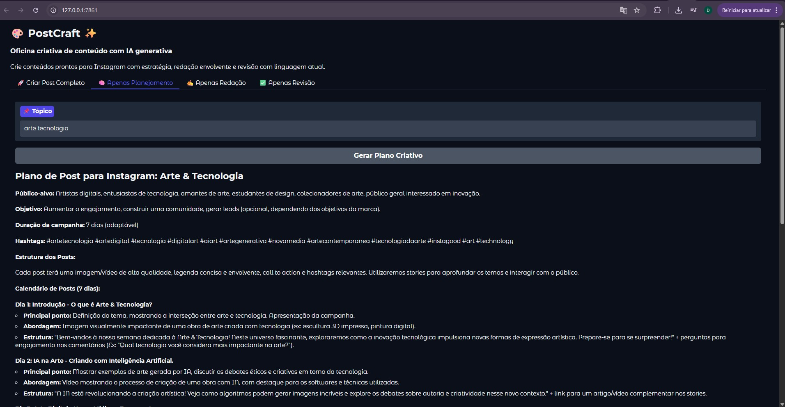

# 📸 PostCraft — IA para criar posts brilhantes no instagram! ✨

**PostCraft** é uma ferramenta criativa baseada em **IA Generativa** que automatiza a criação de conteúdos completos para Instagram. Desenvolvida com **Gradio** e **Gemini 1.5 Flash**, ela entrega tudo que você precisa para impactar sua audiência: **planejamento**, **redação** e **revisão** em um clique. 🚀

---

## ⚙️ Como usar

1. **Configure sua API Key** do Google Gemini.

---

## 💡 Funcionalidades

✅ Planejamento estratégico e estruturado de conteúdo  
✍️ Redação com linguagem humana, simples e engajadora  
🔍 Revisão com tom jovem, direto e motivador  
🎯 Interface organizada com abas para cada etapa  
⚡ Geração instantânea com Gemini 1.5 Flash

---

## 🖼️ Interface

A aplicação oferece uma interface amigável com abas:

- 🔥 **Criar post do zero**  
- 📋 **Só o planejamento**  
- 📝 **Só a redação**  
- 🔍 **Só a revisão**

Você pode escolher a etapa desejada ou gerar tudo automaticamente com um clique.

---

## 📦 Requisitos

- Python 3.8+
- Conta com acesso à API do **Gemini 1.5 Flash**

---

## 📄 Licença

Este projeto está licenciado sob a licença [MIT](https://opensource.org/licenses/MIT).  
Feito com 💜 para criadores de conteúdo e entusiastas de IA.

---

## 🙌 Contribua

Ideias, melhorias ou bugs? Fique à vontade para abrir uma issue ou enviar um pull request.

---

## 🚀 Inspire. Crie. Compartilhe.  
Com PostCraft, criar conteúdo nunca foi tão rápido, criativo e inteligente.  
